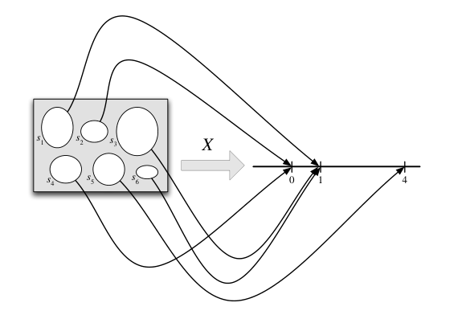

# 3.1 Random Variables

<!-- PAGETOC -->

To make the notion of the random variable precise, we define it as a function mapping the sample space to the real line 

A random variable maps the sample space $\to$ real line. The random variable $\mathbb{X}$ here is defined on a sample space with 6 elements and has the possible values 0,1 and 4. The randomness comes from choosing a random input according to the function $P$ for the sample space

## Random variable

Given an experiment with a sample space $S$, a random variable $r$.$v$ is a function from $S$ $\to$ $\mathbb{R}$ . Random variables are usually denoted by a capital letter 

Thus, the random variable $X$ assigns a numerical value $X(s)$ to each possible outcome $s \in S$ of the experiment. The randomness comes from the fact that we have a random experiment. The mapping itself is deterministic. 

We often use convenient stories that involve tossing coins, drawing balls because they are simple scenarious but many other problems are *isomorphic* where they have the same essential structure but in a different guise. 

## Ex. Coin Tosses 

A fair coin is tossed twice. The sample sapce consists of 4 possible outcomes $S=\{ H H,HT,TH,T T \}$. Here are some random variables on this space. Each $\text{r.v}$  is a numerical summary of some aspect of the environment 

- Let $X$ denote the of number of heads. Here $X$ can take on the value. As a function, $X(s)$ assigns a value to each possible outcome $s \in S=\{ H H,HT,TH,T T \}$ so $X$ assigns the 2 to the outcome $\{ H H \}$, 1 to the outcomes $\{ T H,HT \}$  and 0 for $\{ T T \}$ 

- Let $Y$ denote the number tails. Then in terms of $X$, we have that $Y=2-X$ $\implies$ $Y$ and $2-X$ are the same $\text{r.v}$therefore, $Y(s)=2-X(s)$ for all $s$. 

- Let $Z$ be an **indicator random variable** that takes on the value 1 if the first toss is heads and 0 otherwise. Then $Z(s)$ assigns the value 1 to the outcomes $\{ HH,T T\}$ and 0 to $\{ TH,T T \}$. This $\text{r.v}$ basically "indicates" whether the first toss lands Heads. We can also write the sample space as $S=\{ (1,1),(1,0),(0,1),(0,0) \}$ where 1 represents heads and 0 tails. Then we can write explicit forumlae for $X$,$Y$,$Z$ 
$$
X(s_{1},s_{2}) =s_{1}+s_{1},\qquad Y(s_{1},s_{2})=2-s_{1},\qquad Z(s_{1},s_{2})=s_{1}
$$
	 Or simply we write $X(s_{1},s_{2})$ to mean $X((s_{1},s_{2}))$ ... 

For most $\text{r.v's}$ it is usually unnecessary to do so since there are other ways to define an $\text{r.v}$  and there are many ways to study the properties of an $\text{r.v}$ that do not require computations with an explicit formula for what it maps each outcome $s$ to. 

## Source of Randomness & Why Random Variables?

Since the source of randomness in an $\text{r.v}$ is the experiment itself in which a sample outcome $s \in S$ is chosen with a probability function $P$. Before the experiment the outcome $s$ has not been realized so we do not know the value of $X$. After the experiment, $s$ has been realized so the $\text{r.v}$ takes on the numerical value $X(s)$

Random variabls provide numerical summaries of the experiment in question. This is helpful because the sample space $S$ can be complicated or high-dimensional or the outcomes $s \in S$ may be non-numeric. 

For Example, consider an experiment that collects a random sample of people in a city and ask them questions which may have numer or non-numeric anwsers. Since $\text{r.v's}$ take on numerical values is a convenient simplification compared to having to work with $S$. 
