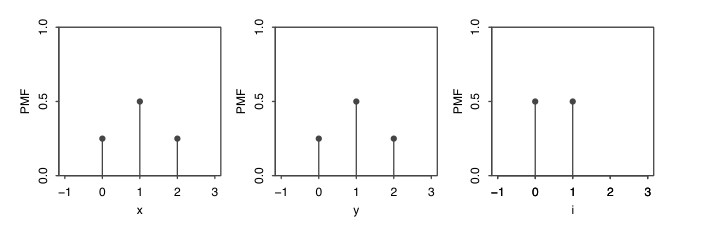

# 3.2 Distributions and Probability Mass Functions

<!-- PAGETOC -->

There are two main types of $\text{r.v's}$ used $\implies$ discrete and continuous $\text{r.v's}$ 
## DRV's

An $\text{r.v}$ $X$ is discrete if there is a finite list of values $a_{1},a_{2},\dots a_{m}$ or an infinite set of values $a_{1},a_{2},\dots a_{3}$ such that, 
$$
P(X=a_{j})=1\quad \text{for some}\quad j
$$
If $X$ is a discrete $\text{r.v}$ then the finite or countably infinite set of values $x$ such that, $P(X=x)>0$ is called the support of X

Most times, the support of the Discrete $r.v$ is a set of integers. However,  continuous $\text{r.v's}$  can take on real value in an interval. We can an $\text{r.v}$ that is a hybrid of discrete and continuous. For Example, by flipping a coin
and then generating a $\text{d.r.v}$ if heads, else generate a $\text{c.r.v}$ if tails. 

To understand such $\text{r.v's}$, we need to know $\text{d.r.v's}$ and $\text{c.r.v's}$  well. 

## PMF's

The probability mass function (PMF) of a discrete $\text{r.v}$  $X$ is the fucntion $p_{X}$ given by
$$
p_{X}(x)=P(X=x)
$$
This is only positive if $x$ is in the support of $X$ and 0 otherwise

## PMF notation

When we write $P(X=x)$ we are using $X=x$ to denote and event consisting of all outcomes to which $X$ assigns the number $x$.  This is also writen $\{ X=x \}$ and is formally, defined as  $\{ s \in S: X(s)=x \}$. 

In 3.12 if $X$ is the number of Heads in two fair-coin tosses, then $\{ X=1 \}$ consists of the sample outcomes $HT$ and $TH$ which are the outcomes to which $X$ assigns 1. Since $\{ HT,TH \}$ is a subset of the sample space, it is an event so we can talk about the probability $P(X=1)$.  

If $\{ X=x \}$ were anything other than an event then $P(X)$ makes no sense as we can not take the probability of an $\text{r.v}$ 

### Ex. Coin Toss Continued...

Find the PMFs of all the $\text{r.v's}$ in Ex 3.12 where two fair coins are tossed. Here are the $\text{r.v's}$ we defined, along with their PMFs on the sample space $S=\{ H H,HT,TH,T T \}$

- $X$, the number of Heads. Since $X$ equals 0 if $T T$ occurs and 1 if $HT$ or $TH$. And 2 if $H H$ occurs, the PMF of $X$ is the function $p_{X}$ given by 
$$
\begin{aligned}
p_{X}(0) =P(X=0)=\tfrac{1}{4} \\
p_{X}(1) =P(X=1)=\tfrac{1}{2} \\
p_{X}(2) =P(X=2)=\tfrac{1}{4} \\
\end{aligned}
$$
  and $p_{X}(x)=0$ for all other $x$ 

- $Y=2-X$, the number of Tails. Similarly as above or using the fact that 
$$
P(Y=y) =P(2-X=y)=P(X=2-y) =p_{X}(2-y)
$$
  the PMF of $Y$ is 
$$
\begin{aligned}
p_{Y}(0)=P(Y=0)=\tfrac{1}{4} \\
p_{Y}(1)=P(Y=1)=\tfrac{1}{2} \\ 
p_{Y}(2)=P(Y=2)=\tfrac{1}{4} \\
\end{aligned}
$$
  and $p_{Y}(y)=0$ for all other $y$. Note that $X$ and $Y$ have the same PMF ($p_{X}=p_{Y}$) even though $X$ and $Y$ are not the same $\text{r.v's}$ ($X$ and $Y$ are two different functions $f:S\to \mathbb{R}$)

- $Z$, the indicator variable that is 1 if the first toss is Heads. Since $Z$ equals 0 for the outcomes $\{ TH,T T \}$ and 1 for $\{ HH,HT \}$, so the PMF of $Z$ is 
$$
\begin{aligned}
p_{Z}(0)=P(Z=0) =\tfrac{1}{2}=p_{Z}(1)=P(Z=1)
\end{aligned}
$$

  and $p_{Z}(z)=0$ for all other $z$ 
  

## Ex. Sum of Die Rolls

Roll 2 fair 6-sided dice. Let the $\text{r.v}$  $T=X+Y$ denote the sum of the 2 rolls where $X$ and $Y$ are the individual rolls. The sample space $S$ will have 36 equally likely outcomes 
$$
S =\{ (1,1),(1,2),\dots,(6,5),(6,6) \}
$$
For Example, after the experiment is performed, we observe values $X,Y$ and $T$ for a given outcome $s = (X,Y)$
$$
\begin{aligned}
 & (1,2) \implies   3 \\
 &  (5,4) \implies 9 \\
 & (4,3) \implies 7 \\
 & \dots
\end{aligned}
$$
Since the dice are fair, the PMF of $X$ is 
$$
P(X=j)=\frac{1}{6}
$$
for $j=1,2,\dots 6$, we say that $X$ has a discrete uniform distribution on $1,2,\dots 6$ and so does $Y$ 

