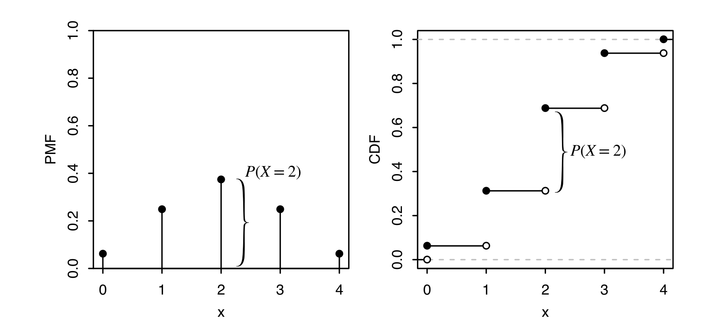

# 3.6 Cumulative Distribution Functions

<!-- PAGETOC -->

Functions that describe the distribution of an $\text{r.v}$ are called cumulative distribution functions (CDF). Unlike the PMF that only discrete $\text{r.v's }$ possess, the CDF is defined for all $\text{r.v's }$ 

## CDF's 

The CDF of an $\text{r.v}$ $X$ is the function $F_{X}$ given by 
$$
F_{X}=P(X\leq x)
$$
When there is no risk of ambiguity we drop the subscript and write $F$ for a CDF

## Converting PMF's $\iff$ CDF's

Suppose $X\sim \mathrm{Bin}(4,0.5)$. The PMF and CDF of $X$ are 

Notice that the height of the vertical par $P(X=2)$ in the PMF is also the height of the jump in the CDF at 2 

### PMF $\implies$ CDF

- To find $P(X \leq 1.5)$, which is the CDF evaluated at 1.5; sum the PMF over all values of the support that $\leq$  1.5 
$$
P(X\leq 1.5) =P(X=0)+P(X=1) =\left( \frac{1}{2} \right)^{4}+4\left( \frac{1}{2} \right)^{4}= \frac{5}{16}
$$
  Likewise, the value of the CDF at some point $x$ is the sum of the heights of the vertical bars of the PMF at values $\leq$  $x$ 

### CDF $\implies$ PMF

- The height of a jump in the CDF at $x$ is equal to the value of the PMF at $x$. Above, the height of the jump in the CDF at $x=2$ is the same as the height of the vertical bar in the PMF at $x-=2$. Flat regions of the CDF represent values that are outside the support of $X$ so the PMF is 0

## Valid CDFs

Any CDF, say $F$ follows 

- Increasing  
$$\text{If }x_{1}\leq x_{2}$ \implies F(x_{1})\leq F(x_{2})$$
- Right Continous: For any $a$, we have 
$$
F(a) = \lim_{ x \to a^{+} } F(x)
$$
- Convergence to 0 and 1 in the limits 
$$
		\lim_{ x \to -\infty } F(x)=0\quad \text{and}\quad \lim_{ x \to \infty } F(x)=1
$$
